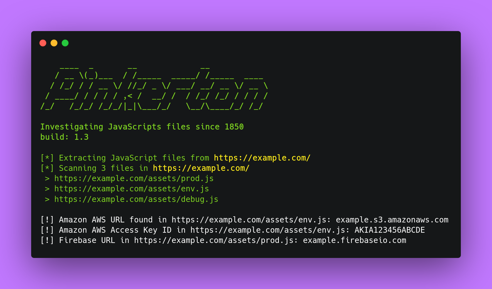

# Pinkerton (In development ⚠️)
> Investigating JavaScripts files since 1850


<div align="center">
    
</div>

<br>

<p align="center">
    
    
    
    
    
</p>

___

<br>

<p> ️🕵️ <b>Pinkerton</b> is a Python tool created to crawl JavaScript files and search for secrets </p>

<br>

## ⚡ Installing / Getting started

<p> A quick guide of how to install and use Pinkerton. </p>

```
1. Clone the repository with: git clone https://github.com/oppsec/pinkerton.git
2. Install the libraries with: pip3 install -r requirements.txt
3. Run Pinkerton with: python3 main.py -u https://example.com
```

<br>

### 🐳 Docker
If you want to use pinkerton in a Docker container, follow this commands:

```
1. Clone the repository - git clone https://github.com/oppsec/pinkerton.git
2. Build the image - sudo docker build -t pinkerton:latest .
3. Run container - sudo docker run pinkerton:latest
```

<br><br>

### ⚙️ Pre-requisites
- [Python 3](https://www.python.org/downloads/) installed on your machine.
- Install the libraries with `pip3 install -r requirements.txt`

<br><br>

### ✨ Features
- Works with ProxyChains
- Fast scan
- Low RAM and CPU usage
- Open-Source
- Python ❤️

<br><br>


### 🔨 Contributing

A quick guide of how to contribute with the project.

```
1. Create a fork from Pinkerton repository
2. Clone the repository with git clone https://github.com/your/pinkerton.git
3. Type cd pinkerton/
4. Create a branch and make your changes
5. Commit and make a git push
6. Open a pull request
```

<br><br>

### ⚠️ Warning
- The developer is not responsible for any malicious use of this tool.